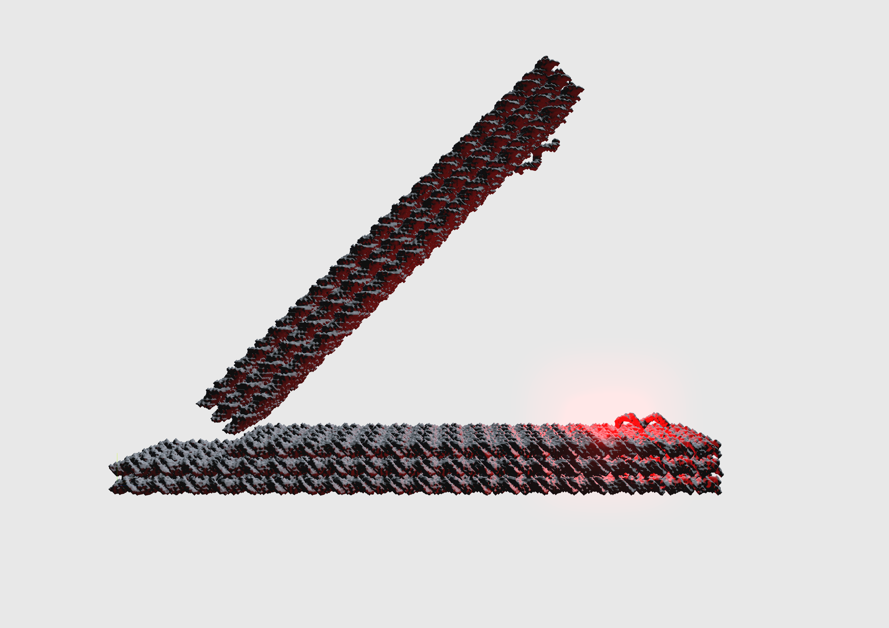

# NADOC — Not Another DNA Origami CAD

A research-grade DNA origami design tool built for precision, extensibility, and
scientific rigour.  Every design decision is grounded in peer-reviewed literature
and validated through a systematic experiment pipeline.

## Getting Started

**Never used a terminal before?** Read [INSTALL.md](INSTALL.md) — a click-by-click
guide for Windows (WSL2), macOS, and Linux that needs no prior experience.

**Already comfortable on the command line?** Three steps:

```bash
git clone https://github.com/DNA-origamicon/NADOC.git
cd NADOC
./setup.sh        # installs uv, Node.js, just + all deps (run once)
./start.sh        # starts backend + frontend together
```

Then open **http://localhost:5173** in your browser. Press **Ctrl-C** to stop.

`setup.sh` is a full bootstrap: it installs everything NADOC needs (you do **not**
need to install Python or Node yourself — `uv` even fetches Python 3.12 for you),
creates a private virtual environment, and installs all backend + frontend
dependencies. It's safe to re-run. Works on Linux, macOS, and Windows via WSL2.

To try it, click **File → Open File…** and load a design from `Examples/`
(e.g. `Examples/6hb_test.nadoc`).

See [START.md](START.md) for the day-to-day run commands and the WSL2 networking note.

## Architecture

NADOC enforces a strict three-layer separation:

| Layer | Purpose | Files |
|-------|---------|-------|
| **Topological** | Strand graph, crossover connectivity, loop/skip modifications. Ground truth. | `backend/core/models.py`, `lattice.py`, `loop_skip_calculator.py` |
| **Geometric** | Helix axes, nucleotide positions derived from topology + B-DNA constants. | `backend/core/geometry.py`, `deformation.py` |
| **Physical** | XPBD/oxDNA relaxed positions. Display only, never written back. | `backend/physics/xpbd.py`, `oxdna_interface.py` |

## Stack

- **Backend**: Python 3.12, FastAPI, Pydantic v2, NumPy, uv
- **Frontend**: Three.js (Vite), vanilla ES modules
- **2D Editor**: Canvas 2D (pathview) + SVG (sliceview), BroadcastChannel sync

## Why NADOC

caDNAno (Douglas et al., *Nature* 2009) established the lattice-based idiom for
scaffolded DNA origami that the whole field still builds on. Traditional design
tools in that lineage, however, remain 2D schematic editors: you route the
scaffold and break staples by hand on a flat path view, with no 3D feedback, no
physical model, and no concept of structure beyond a single straight bundle.
NADOC keeps the honeycomb/square lattice idiom designers already know and
rebuilds around it as a modern, browser-based three-layer engine —
**topology → geometry → physics** — that closes those gaps:

| Limitation of traditional tools | What NADOC does instead |
|---|---|
| **2D path/slice schematic only** — you fold blind to the 3D result | Real-time 3D view derived from B-DNA geometry, with coarse-grained, all-atom, and molecular-surface representations |
| **Idealized straight bundles** — global twist/bend only via hand-computed insertions/deletions | Geometric bend/twist deformation layer **and** topological loop/skip (Dietz, Douglas & Shih, *Science* 2009) with enforced physical limits (6–15 bp/turn, minimum bend radius), updated live in 3D |
| **No physical model** — shape is guesswork until an external solver | Built-in XPBD real-time relaxation, oxDNA batch relaxation, and Euler–Bernoulli FEM with an RMSF heatmap |
| **Manual scaffold routing & staple breaking** | CSP scaffold router + seamless router and auto-staple, plus drag-to-resize / drag-to-shift / spreadsheet editing in an overhauled 2D editor |
| **M13 threading only — no functional-sequence design** | Orthogonal overhang sequence generation (Johnson et al. 5-mer rare-sequence algorithm) with GC, secondary-structure, and corpus-diversity filtering |
| **A single monolithic object** — no hierarchy or assembly | Parts library + assembly CAD: mate connectors, kinematic cluster joints, cross-part overhang binding, and 1D polymerization of repeating units |
| **Poly-T loops only — no first-class overhangs, linkers, or conjugates** | Overhang subdomain model with ssDNA/dsDNA linkers (freely-jointed-chain / duplex geometry + relaxation), protein attachment from PDB, and fluorophore/FRET modeling |
| **No design history or conformational animation** | Snapshot-bearing feature log with revert/edit, plus camera poses, keyframes, and pre-baked 60 fps animation |
| **Schematic cartoons for publication figures** | Photo mode — PBR materials, HDRI lighting, subsurface scattering, fluorophores as real light sources, progressive path tracing, and 300/600 DPI tiled export (see below) |
| **A separate converter for every downstream tool** | One-click atomistic (PDB/PSF), NAMD package, and GROMACS export; native import of caDNAno v2 **and** scadnano designs |
| **No path from model to a physical object** | One-click 3D-print export of the molecular surface — watertight binary STL, or a multi-color 3MF (scaffold plus three map-colored staple sets, so touching staples print in different filaments) auto-scaled for a consumer printer bed |
| **Desktop install on a heavyweight GUI toolchain** | A web app — one `./setup.sh`, open a browser; runs on Linux, macOS, and Windows (WSL2) |

Every behavior is grounded in peer-reviewed literature (`Literature/`) and
validated by a large backend test suite — run `just test` to see current state.

## 2D Cadnano Editor

A full interactive caDNAno-style 2D editor running in a separate browser tab,
synced bidirectionally with the 3D view via BroadcastChannel and a shared FastAPI
backend.

### Sliceview (SVG)
- Honeycomb and square lattice grids
- Click cell to activate/deactivate helices (calls backend API)
- Helix labels reflect creation order

### Pathview (Canvas 2D)
- Activated helices as horizontal double tracks (forward + reverse)
- Scaffold pencil tool: click-drag to draw scaffold domains cell by cell
- Auto-scaffold button routes and connects painted segments
- Zoom, pan, helix label gutter

### Sync model
```
2D mutation → POST API → BroadcastChannel "design-changed" → 3D re-fetches
3D mutation → BroadcastChannel "design-changed" → 2D re-fetches and redraws
```

Multiple 2D editor tabs stay in sync automatically — backend is ground truth.

## Additional Features

### Cluster system & animation
Helices grouped into named clusters; per-cluster deformation ops; feature log
timeline with draggable playhead; pre-baked animation at 60 fps (one geometry
batch fetch, then pure client-side lerp).

### Loop/skip topological deformation
Implements the Dietz, Douglas & Shih (Science 2009) mechanism for bending and
twisting bundles by inserting/deleting base pairs. Enforces physical limits
(6–15 bp/turn twist density, min bend radius).

### Atomistic & NAMD export
All-atom template with PDB/PSF export. One-click NAMD simulation package (ZIP)
with GBIS implicit solvent config. PDB export can use either native NADOC
coordinates or the currently displayed simulation/FEM coordinates. Scalar maps
(RMSF and deviation) can be embedded as per-atom B-factors using the current
legend bounds and colormap; the export dialog enables this by default, and the
`?` controls beside colored visualization modes provide the matching ChimeraX
`color byattribute bfactor` command.

NAMD job creation is intentionally separate from execution. A design without complete
scaffold and staple sequences may be saved as a deferred job, but **Run** refuses it with
an actionable sequence warning. Assigning the sequences automatically prepares that job
without starting dynamics; the resulting sequenced PSF atom count then drives disk, VRAM,
throughput, and remote-resource projections before the prepared package can run.

In ball-and-slab views, each bead-to-slab connector inherits the slab's current instance
color. This applies equally to right-sidebar strand/base/cluster coloring and visualization
card scalar maps (RMSF flexibility, deviation, strain, and CanDo), including animated
geometry refreshes and restoration when a map is cleared.

Large-design exports use the validated interpolated phosphate-bridge builder,
reuse cached native atomistic models and already-computed oxDNA RMSF average
frames, and precompute PDB hybrid-36 identifiers. HTTP gzip reduces the transfer
size transparently (the saved file is still a normal `.pdb`). Full reciprocal
`CONECT` topology is retained so importing the PDB preserves strand connectivity.

### oxDNA relaxation → NAMD seed pipeline
Local oxDNA (CUDA) coarse-grained relaxation as a Dynamics sub-panel: staged
MC → MD relax → equilibration → optional production, with live progress, a stage
timeline, ETA, and health readouts (base-pair retention, energy convergence,
clash). An **"OxDNA display"** toggle deforms the model to the relaxed positions
(PBC-unwrapped + Kabsch-aligned). A **flexibility map** toggle colors every base
by its per-base RMSF over the production run (viridis, rigid→flexible) with an
adjustable in-workspace scale (draggable bounds, live recolor). A completed job
feeds NAMD via **"Use as NAMD seed"**: the relaxed coordinates (reconstructed at
the true backbone site, ~1.6 nm cross-pair) seed the all-atom run so it starts
pre-relaxed instead of from ideal B-DNA — for seeded jobs the NAMD relaxation
ladder is optional and production can run minimize-then-produce directly from the
seeded structure.

### Live MD display
A **"Display MD (live)"** toggle in the Dynamics tab streams the latest frame of a
running (or completed) NAMD job onto the design model — PBC-unwrapped and
Kabsch-aligned to the design so the structure sits still while it breathes,
updating as the simulation writes frames. The newest DCD frame is read in **O(1)**
by a direct byte-seek (`backend/core/dcd_fast.py`) rather than reparsing the whole
growing trajectory, so a live poll is ~tens of ms. Trajectory atoms are mapped to
the design through the PSF's **segids** (via the package's `charge_audit.json`),
which handles solvated multi-segment CHARMM/psfgen packages where the reference
PDB's single-character chain field collides across strands.

Opening a design that has a running MD job **prewarms** the display in the
background (parse the topology + build the atomistic model once), and a readiness
dot beside the toggle shows *warming → ready*, so flipping it on paints the latest
frame instantly. Toggling off keeps the socket warm (no re-parse), and a re-toggle
re-applies the cached frame immediately. A trajectory scrubber, playback, and a
flexibility (RMSF) map mirror the oxDNA display controls.

### FEM structural analysis
Euler-Bernoulli beam model; RMSF heatmap via eigenvalue decomposition; real-time
WebSocket streaming.

### Overhang sequence generation
Johnson et al. (DOI: 10.1021/acs.nanolett.9b02786) 5-mer rare-sequence algorithm:
builds an occurrence score map across the full scaffold + weighted staple corpus,
seeds from lowest-occurrence 5-mers, greedily extends to target length, then filters
by GC content (35–75%), secondary structure (hairpin/self-dimer), and final corpus
score percentile.  Mutual diversity is enforced by adding each generated sequence × 10
to the corpus before generating the next.  Available per-overhang via the spreadsheet
Gen button or in batch via Tools → Sequencing → Generate Overhangs.

### Overhang binders & strand animation
A dedicated **OH-binder** strand type designates oligos that hybridize to an
overhang (the complement of a sticky end, a linker's binding domain, etc.).
Binders carry a per-domain `binds_overhang_id` link, so the same machinery covers
free binders and the complementary domains of linker strands. Right-click a
scaffold strand (3D or cadnano view) to **convert to / from an OH binder**;
pen-drawing on an existing overhang auto-tags the new strand; sequence edits sync
bidirectionally as reverse complements (set the overhang sequence → the binder
gets its RC, and vice-versa). Binders get their own spreadsheet line and a magenta
label.

A collapsible **Strand Animation** sidebar section (below Overhangs) animates the
un/hybridization of a selected overhang and its binder by driving the *real* beads
(display layer only — `setBeadOverrides`, restored on clear; topology never
mutates). Two modes:

- **Unzip** — the duplex melts from the root, a per-base melt fork travels toward
  the free tip, the overhang unwinds into a line at constant radius while the
  binder peels into a straight splayed arm.
- **Toehold displacement (TMSD)** — a synthetic invader (no backend) binds the
  toehold and branch-migrates, displacing the binder; the binder front leads the
  invader by a tunable gap so the two strands never clip.

Each mode renders in a **helical** or **straight** (de-spiraled, root-aligned)
form, with live controls for the reaction coordinate (φ), melt width, splay /
exit / invader-splay angles, ssDNA stretch, unwind, and branch gap. Works with
overhang and binder of unequal length.

### Belt & pulley systems

Assembly-level **belt/pulley mechanisms** built on the revolute-mate + gear-relation
machinery. Define a belt by picking two revolute mates as pulleys and a rim connector on
each (radius = perpendicular distance to the axis); the open belt (external tangents) is
previewed as a glowing line and persisted on `Assembly.belt_paths`. The two pulleys are
**kinematically coupled** like a gear pair but with belt physics — angular ratio
`r_a / r_b` (equal rim speed) and the same world rotational sense — so rotating either
pulley (ring, gizmo, or RPM spin) drives the other; coupling propagates through the same
graph as gears, on the backend and the per-frame kinematics ticker.

**Belt riders** attach a part to the belt: pick a connector on the part, click a point on
the loop, and the part is seated (connector normal → travel tangent) and stored relative
to a moving belt frame. Riders **ride the loop** drift-free — position derived from the
absolute pulley angle (`arc` advances by `Δθ · r / L`), so spinning a pulley carries the
part around the belt. **Polymerize along belt** fills the loop with a chain of identical
riders, auto-spaced edge-to-edge from the part's footprint along the tangent, so a whole
train rides together. Display-layer only (assembly transforms + belt records); embedded
Designs are never mutated.

### Fluorescence & FRET
Strand terminal extensions with fluorophore beads; FRET checker with Förster
radii (Cy3→Cy5, FAM→TAMRA, ATTO488→ATTO550).

### Surface representations
Van der Waals and solvent-excluded surfaces via marching cubes; strand coloring;
opacity slider.

### Photo mode



Publication-grade rendering pipeline that swaps the live scene into a PBR
pipeline on entry and restores cleanly on exit. Features:

- **PBR materials per representation** — Full / Cylinders / Atomistic / Surface
  presets (Matte, Glossy, Metallic, CPK variants). Backed by `MeshPhysicalMaterial`.
- **HDRI environment** — synthetic Room Studio (built-in, no asset shipped) or
  user-uploaded `.hdr` (equirectangular). PMREM-baked envmap drives IBL
  reflections + optional backdrop. Re-baked per-renderer for export.
- **Subsurface scattering / translucency** — `Wax` and `Skin` SSS surface
  presets with `attenuationColor` / `attenuationDistance`; global
  Translucency slider applies transmission to Full + Cylinders reps.
- **Lighting rig** — six presets (Scientific, Studio, Soft Box, Dramatic,
  Flat, Back-lit) with yaw / pitch sliders.
- **Fluorophores as ray-traced light sources** — toggle spawns one
  `THREE.PointLight` per fluorophore at its world position (color from
  per-instance fluorophore emission), so metals reflect the fluorophore in
  raster mode and the path tracer treats it as an area emitter.
- **Post-processing** — SSAO tuned for nm-scale DNA, SMAA, optional
  Unreal-style Bloom for the LED halo effect.
- **Progressive path tracing** via `three-gpu-pathtracer` with live sample
  counter, switchable from the Quality toggle.
- **Tiled high-resolution export** — 300 / 600 DPI PNG output (4200×2970 /
  8400×5940). Renders are tiled via `camera.setViewOffset()` to bypass the
  GPU's `MAX_TEXTURE_SIZE` limit, then stitched on a 2D canvas.

## Development

```bash
# Start backend + frontend dev servers
just dev

# Run all tests
just test

# Run a specific test file
just test-file tests/test_loop_skip.py

# Format and lint
just fmt
just lint

# Run an experiment
uv run python experiments/exp10_twist_loop_skip/run.py
```

## Experiment pipeline

Each experiment in `experiments/expNN_*/` follows a fixed structure:

```
hypothesis.md   — prediction written before running
run.py          — executable script producing results/ artefacts
conclusion.md   — analysis written after running
results/        — figures (*.png) and metrics (metrics.json)
```

## Literature

Key references in `Literature/`:

- **Dietz, Douglas & Shih, Science 2009** — Loop/skip bend/twist mechanism
- **Douglas et al., Nature 2009** — caDNAno tool (crossover conventions)
- **Schlick et al. 2022** — scadnano conventions
- **Rothemund, Nature 2006** — Scaffolded DNA origami primer
