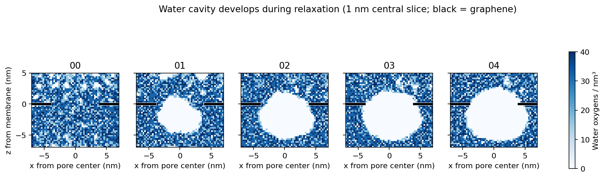

# cube_pore P1 Alpine transport audit

Production job: a4cb52583c26. Parent relaxation: 60e854232e8c.
Local trajectory: 2,374 frames, 40 ps apart, 0.04–94.96 ns. This is not the full requested 200 ns.

## Finding

Zero saved ion crossings is supported by an independent minimum-image crossing calculation over all 6,619 ions. It does not establish that the DNA origami physically seals the nanopore. A largely dry aperture and a water-free region immediately below it are a major confounder.

Water oxygen counts inside the 4 nm radius aperture, in a 0.5 nm thick slice centered at the membrane plane:

| Structure/frame | Water molecules |
| --- | ---: |
| Parent original solvated PDB | 744 |
| Production reference PDB | 0 |
| Production 0.04 ns | 0 |
| Production 47.52 ns | 12 |
| Production 94.96 ns | 2 |

Slices centered 0.5, 1, 2, and 3 nm below the membrane contain zero water oxygens at all three sampled production frames. The parent original PDB contains 799, 748, 912, and 775 respectively. Coordinates were converted from Å to nm and minimum-imaged relative to each package's recorded pore center and periodic box. Water was selected by TIP3/OH2; production coordinates were read directly from DCD atom records using PSF ordering.

The original aperture was solvated; the dry cavity was present by production initialization after parent relaxation. Whether its formation is caused by solvent density, the wall interaction model, or another equilibration issue remains unresolved. Both relaxation and production configurations disable the barostat; stages named NPT are actually fixed-volume for this graphene system. This is a relevant setup choice, not proof of the cavity's mechanism. Do not simply turn on an isotropic barostat: the restrained periodic graphene references require compatible cell handling.

## Geometry and force checks

At the first and last production frames no DNA atoms occupy the aperture within ±0.5 nm of the membrane plane. The closest DNA atoms in the aperture are approximately 1.16 and 1.20 nm from the plane. At three sampled frames, about 98.5–98.8% of a grid within radius 3.8 nm at the membrane plane has more than 0.3 nm distance to any solid atom. This is a geometric clearance diagnostic, not a conductance calculation or a full connected-path test through the origami above the pore.

The graphene plane remains aligned with the detector. The topology gives Na +1e, Cl −1e, graphene 0e, and a neutral total system. Actual production restraint coefficients are zero for DNA, water, and ions; graphene sites have coefficient 10. There is no additional explicit wall force in the production config. NGRC self-LJ is disabled while solvent interactions remain present.

## Applied potential

Production config specifies `eFieldOn on`, `eField 0 0 6.9181643`, and `eFieldNormalized yes`.

300 mV × 23.060547830619 kcal/(mol e V) = 6.918164349 kcal/(mol e).
The box length along z is 24.2394 nm, giving an imposed field of approximately 0.0123766 V/nm in +z. The conversion is correct according to NAMD's normalized-field definition:
https://www.ks.uiuc.edu/Research/namd/2.11/ug/node42.html

This checks the packaged input, not the actual runtime log or the spatial electrostatic potential profile. The imposed cell voltage is not a measurement of the local voltage drop across a hydrated pore.

## Interpretation and next validation

Do not interpret zero current as demonstrated origami blockade. First establish a hydrated, stable reservoir/pore during equilibration and verify an open-pore control with the same wall, salt, and voltage. Compare the origami system only after those checks. The present trajectories and jobs were not modified or restarted by this audit.

## Follow-up: formation during relaxation

Read the parent binary coordinate checkpoints directly (float64 Å coordinates, PSF atom order), using the same periodic pore-centered slices. At the pore plane, water oxygen counts after minimization and after relaxation stages 01–04 are **816, 552, 146, 1, 0**. This establishes progressive evacuation during relaxation, before the production field is applied. All four checked relaxation restraint files give water oxygens and ions coefficient zero. No electric-field, Tcl-force, Colvars, or fixed-atom directives occur in the parent configurations. The solvation exclusion in `namd_solvate.py::_exclude_waters_near_graphene` removes only oxygen positions within 0.30 nm of actual graphene sites, not the aperture volume.

The figure shows instantaneous water oxygen density in a 1 nm thick central y slice, with 0.25 nm x/z bins. White means no oxygen in that bin; black marks the graphene outside the pore. The rounded growing cavity is consistent with cavitation/dewetting, rather than deletion of waters from a prescribed cylindrical region. Its underlying thermodynamic cause still requires a density/pressure and wall-model control; the shape alone does not validate the setup.
