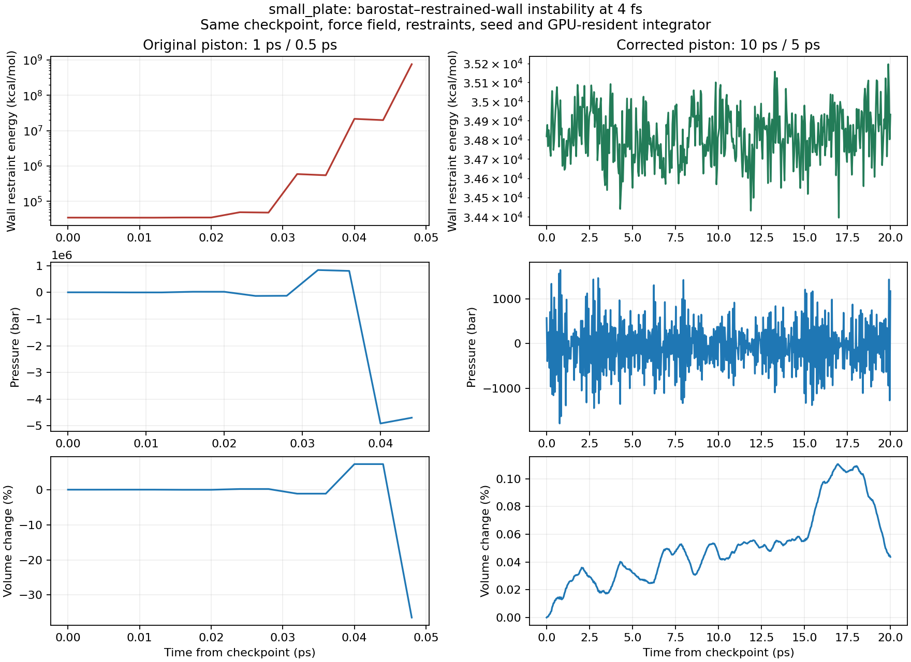

# small_plate Slurm 32089399: restrained-wall/barostat instability

## Diagnosis

The CUDA exclusion mismatch is a downstream symptom of an unstable isotropic
Langevin piston coupled to the Cartesian restrained graphene sheet. It is not a
cutoff defect, the previous graphene self-LJ defect, or a necessary consequence
of reducing ENM k from 0.1 to 0.01.

The original job is `7aa73d7afe93`, Slurm `32089399`, Alpine
`c3gpu-g7-u9`, NAMD Git-2025-12-04. It failed in
`small_plate_03_300K_NPT_ENM_k0p01_p10` with three missing CUDA exclusions.
The downloaded log printed energy only every 4,000 steps, obscuring the instability.

The preceding k=0.1 p10 stage had itself failed with the patch-grid fatal at its
original 1000/500 fs piston settings. Its recovery record shows attempt 1 from
step zero; `remote_cell_recovery.recover` multiplies the original period and decay
by ten. That successful stage therefore used **10000/5000 fs**. The p25 through
p100 coordinate checkpoints are byte-identical to p10 (early-stop bridges).
The next stage loads those coordinates and cell but restores **1000/500 fs**
from its own generated configuration. Recovery was local to the failed segment.

The intact starting checkpoint has normal bonded geometry (maximum minimum-image
PSF bond length 1.698 A) and temperature 297.27 K. The wall uses NGRC with zero
NGRC–NGRC NBFIX and retains k=50 kcal/mol/A² positional restraints.

## Local causal controls

Local hardware is an 8 GB RTX 2080-class GPU, with patched NAMD 3.0.2p1,
not the Alpine GPU or binary. All replays use the same downloaded coordinate,
velocity, and cell checkpoint, PSF, force field, seed and original 4 fs timestep.
Diagnostic replays change the output cadence; original files are preserved.

| Replay | Result |
|---|---|
| Original settings, margin 3 | CUDA exclusion failure after step-10 energy |
| Margin 4 only | Same energy divergence and CUDA exclusion failure |
| GPU offload only | Same divergence; RATTLE failure |
| Retain ENM k=0.1 | Same divergence; atoms moving too fast |
| Piston period/decay 10000/5000 fs only | **5,000 steps / 20 ps completed** |

The last control preserves GPU-resident mode, 4 fs, HMR, rigid bonds, NPT,
margin 3, cutoff 10 A, pairlist 13.5 A, k=0.01 ENM and all physical restraints.
Its 501 energy samples have temperature 296.735–298.782 K, boundary energy
34,396–35,196 kcal/mol, and volume 8,028,997–8,037,877 A³ (+0.111% maximum).

A separate original-settings trace recorded every step:

| Step | Pressure (bar) | Volume (A³) | Boundary energy (kcal/mol) |
|---|---:|---:|---:|
| 0 | 570 | 8,028,997 | 34,818 |
| 2 | -3,614 | 8,029,467 | 34,714 |
| 4 | 21,759 | 8,026,658 | 35,061 |
| 6 | -134,435 | 8,044,007 | 49,413 |
| 8 | 835,475 | 7,937,540 | 591,750 |
| 10 | -4,910,621 | 8,613,391 | 21,510,041 |
| 12 | overflow | 5,104,989 | 752,109,712 |

This alternating, amplifying pressure/volume response begins before temperature
runs away. Isotropic dilation displaces a large, stiff Cartesian restrained sheet;
its restraint virial drives the next overcorrection. Independent calculation of
`sum(50 * minimum_image_distance_to_reference**2)` over all 38,617 graphene sites
from the trace DCD gives 21,510,041.69 kcal/mol at step 10 and 752,109,710.52
at step 12, matching the entire logged boundary energy to DCD precision.
The wall RMS displacement grows to 3.338 A and 19.736 A respectively.

## Fix and existing job

`namd_graphene.graphene_pressure_conf` imposes a 10000/5000 fs minimum period/decay
when composing restrained graphene NPT configurations. Already slower settings
are retained. NVT and non-graphene configurations are unchanged. The helper is
used when attaching harmonic wall restraints to prepared configurations and for
appended and replica production, preventing the stage-boundary reset and the
previous even faster 200/100 fs production default. The timestep, ensemble,
coordinates, wall model and restraint parameters are unchanged.

During the diagnosis, the runtime backend was not restarted, preserving its authenticated Alpine
session. The user subsequently restarted it before preparing the verified Alpine copy below. Read-only OS probes once per minute keep traffic on that existing session
for a bounded four-hour window. This cannot override server-enforced expiry.

The original job is untouched. A separate `recovery_package` under
`experiments/namd_32089399_diagnosis` contains corrected configurations and links to
read-only original inputs and the intact k=0.1 checkpoint. No remeshing, rebuilding,
reminimization, or reuse of the exploded trace is needed for this correction.
`run_full_segment.sh` runs the original 120,000-step k=0.01 segment with its original
output cadences in that isolated package under the test guard.

## Validation status

- Final focused configuration/anchor/ensemble tests: **75 passed**; production-cell
  checks: **21 passed** (96 scoped checks total).
- Ruff and `git diff --check`: passed.
- `just test-smart` selected **FULL** because of accumulated workspace changes,
  with the user-opened test session active. Interrupted after 27 min 53 s at 99%
  while a CPU-heavy worker remained active: **8009 passed, 11 failed, 83 skipped,
  1 xfailed, 1 error**. No DEFERRED groups were emitted; this is an incomplete,
  non-green broad run.
- Broad failures include seven missing-design-fixture failures, SNUPI RMSF and
  surface baseline assertions, a VoltronCoreArm cluster-fixture assertion, and one
  source-inspection failure. The latter read the wrong function after source line
  offsets changed during the run; all 21 production-cell tests passed on the final
  isolated rerun. The setup error is the existing BigO 168-versus-56 fixture mismatch.
  Full traceback details are in `test-smart.log`; unrelated fixtures/baselines were
  not altered to make these tests pass.
- The original 120000-step isolated continuation has not been run. The corrected Alpine
  copy was submitted and observed RUNNING on September 5; see the upload verification below.
- The 20 ps result establishes a causal local fix for the immediate instability;
  it does not establish full-ladder equilibration or Alpine execution success.

Reproducible inputs, logs, energy CSVs, coordinate-derived energy calculations and
`results.json` are under `experiments/namd_32089399_diagnosis`.

## Corrected Alpine copy verified — 2026-09-05 21:11 UTC

The user copied the running local R2 job `4a293b5d915b`, edited its target to Alpine,
and submitted the new draft `e75ffd56c6f8`. Preparation rebuilt its package with the
current code. All 22 active NPT configurations use 10000/5000 fs, including the
k=0.01 p10 transition; its 4 fs timestep and predecessor checkpoint references remain
intact. The actual NGRC force-field package passed validation.

All 75 inputs (2,083,560,826 bytes), plus seven submission/helper files, have successful
SFTP completion records. Input byte counts match; all local SHA-256 hashes remained
unchanged through upload. Independent remote hash readback was not performed.
SLURM `32108809` reported RUNNING on `c3gpu-g7-u5`, partition `artxpro6000`, from
`/scratch/alpine/jojo6687/nadoc_jobs/e75ffd56c6f8`. This verifies submission of the
corrected package, not completion of the previously failing transition or full ladder.
See the [upload audit](../experiments/namd_e75ffd56c6f8_upload_audit/README.md).

The copied-draft UI now follows the saved target: “Submit to Alpine,” the Alpine
connection gate and target pane refresh after saving edits to the selected job.
Its launch still prepares the draft before submission. Verification: 257 jobs-panel
unit tests and the browser local → Alpine → local settings regression passed.
The complete frontend suite returned 6,165 passed and three failures (accessibility,
renderer visibility, and API request coalescing), reproduced separately.
