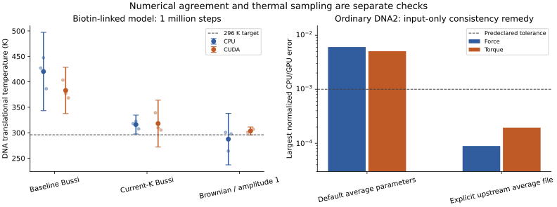

# oxDNA corrective-work A/B audit — 2026-09-13

**Status: completed.** Screening: 108/108 completed; longer follow-up: 18/18; full-build NVE: 36/36; model sensitivity: 24/24. No candidate has been promoted to the installed engine or application defaults. All results below distinguish a numerical correction from a change in model parameters.

The managed engine remains `8028cf33b3cba12992b771156085fa54879f50cd-adaptive-memory-bussi-v2`. Its executable hash and source patch match the starting baseline. Additional RunPod compute spend: **$0**. Short CPU array `32541315`; longer CPU array `32541783`; full-build NVE CPU array `32542632`; GPU: local RTX 2080 SUPER. Detailed inputs, candidate patches, scripts, and fixture hashes are in [the reproducibility package](../../scripts/validation/oxdna_physics_ab/README.md); all derived results are in [the JSON report](oxdna_physics_ab_2026-09-13.json).

Numerical tolerances and timing-resolution targets below are acceptance criteria for this audit, not a universal published oxDNA certification standard.

## Decisions and limits

| Corrective item | A/B result | Decision |
| --- | --- | --- |
| Protein–DNA contact strength | Both CPU→2 and GPU→1 eliminate the isolated force/torque mismatch; protein–protein and outside-cutoff controls remain correct. | Retain both candidates. Numerical agreement does not choose the experimentally appropriate strength. |
| Bussi current kinetic energy | The erroneous approximately 50% rescaling at vanishing coupling becomes approximately 0.00013% on CPU and GPU. | Limit test passes; full-system temperature and mixing are separate gates. |
| Point-particle rotations | Point angular momentum becomes exactly zero. Force-free physical trajectories, including sorted CUDA particles, are unchanged. | Keep isolated; interacting CUDA repeatability and runtime controls are included below. |
| Brownian input rendering | Old renderer fails for missing `pt`/`diff_coeff`; explicit diffusion in the candidate starts successfully. Default Bussi text remains identical. | Candidate renderer only; no implicit diffusion or thermostat replacement. |
| Caps, velocity handoff, and coupling units | Inactive caps leave forces unchanged; active caps alter forces. Velocity refresh changes momenta. Scaling tau and update cadence with dt preserves the force-free coupling history. | Treat these as explicit protocol choices, not universally beneficial default changes. |
| Ordinary DNA2 regression | Baseline average-sequence CPU/GPU forces differ by about 0.6%; the upstream explicit average parameter file reduces the force error to about 0.009%. | Input-only remedy tested; no new interaction kernel required. |
| Uncapped energy convergence | CPU DNA energy error decreases by approximately fourfold per timestep halving. Matched GPU inputs remove most of the apparent drift, leaving a precision-limited residual. | Do not label an energy-reference mismatch a nonconservative integrator. |
| Interacting streptavidin/DNA sampling | Three seeds, three geometries, six arms; longer runs follow up the hardest biotin-linked case. | Report temperature failures, uncertainty, and mixing rather than treating nonsignificance as equivalence. |
| Orientation, anchor, ANM, linker assumptions | One-factor sensitivities change the relevant motion/strain in expected directions. | Sensitivity established; experimental accuracy remains unvalidated. |
| Performance and upstream distance | Randomized paired timings and unchanged-binary controls accompany the physical tests. | Do not promote a reproducible slowdown or infer agreement with unavailable experimental benchmarks. |

## What the upstream record establishes

The [ANM merge discussion](https://github.com/lorenzo-rovigatti/oxDNA/pull/192) explicitly describes unit particle masses and leaving existing thermostat/integrator code unchanged. Its examples were identified as manual examples rather than automated tests. The pinned hybrid cage uses John/Brownian coupling; the protein-only KDPG example uses Langevin. These are useful regression inputs, not evidence that either protein–DNA contact amplitude was calibrated against coated-particle experiments.

The local development archive also records the original choice: on 2026-06-14, NADOC switched its draft Brownian relaxation settings to the official origami relaxation recipe (`bussi_tau=1000`, `newtonian_steps=53`). See [the archived implementation notes](../../memory/project_oxdna_relaxation_archive.md#13-update-2026-06-14-afternoon--standard-protocol--real-binary--validation). The nanoparticle notes explicitly describe adsorption/binding as uncalibrated. These records support recipe inheritance as the documented rationale; they cannot rule out private or unpublished upstream evidence.

Bussi stochastic velocity rescaling is a published canonical thermostat, not an obsolete method: [Bussi, Donadio & Parrinello (2007)](https://doi.org/10.1063/1.2408420). The [official relaxation recipe](https://lorenzo-rovigatti.github.io/oxDNA/relaxation.html) still uses it. Efficient energy removal during preparation, canonical sampling, and solvent-like dynamics are different requirements. Correcting the current-energy update does not establish rapid mixing of a stiff protein network and a weakly coupled DNA subsystem.

The [published ANM model](https://doi.org/10.1039/D0SM01639J) includes protein fluctuation/B-factor validation. That does not establish the correct coating orientation, coverage, biotin linker, or excluded-volume amplitude for this NADOC construct. We have no access to unpublished validation data or private maintainer rationale. The audit therefore makes no claim of improved experimental agreement, changes no residue masses, and does not silently choose one contact strength. No maintainer message or issue was sent.


Temperature error bars use three independent seed means. The long GPU Brownian arm also changes contact amplitude; it is a combined candidate, not an isolated thermostat contrast.

## Isolated force, torque, and thermostat tests

| Variant | Native pair runs | Largest error vs specified potential | Largest CPU/GPU force difference |
| --- | --- | --- | --- |
| baseline | 60 | 0.000229 | 1 |
| gpu_epsilon1 | 60 | 0.000229 | 0.000229 |
| cpu_epsilon2 | 60 | 0.000229 | 0.000229 |
| combined_epsilon1 | 60 | 0.000229 | 0.000229 |
| combined_epsilon2 | 60 | 0.000229 | 0.000229 |

The pair matrix covers core and smoothing branches, outside-cutoff controls, protein–protein controls, rotated DNA frames, and two impulse timesteps. Forces and body-frame torques are checked against an independently differentiated potential. The specified tolerance is 1e-3 in normalized vector error. Both matching directions pass; the baseline fails CPU/GPU matching. At the tested contacts, the baseline GPU force is approximately twice the CPU force. This is a Hamiltonian mismatch, not a universal factor-of-two error in every DNA force.

At `bussi_tau=1e9`, the baseline changes off-target kinetic energy by approximately −50.00009% in one step. Replacing the cached target with the measured current kinetic energy changes it by approximately −0.000133%, satisfying the predeclared <0.1% limit. CPU, CUDA, and both combined candidates agree on this result. This check is deliberately independent of proteins, springs, and contacts.

The rotation mask preserves random draws. Pure-DNA, mixed, and pure-point controls cover CPU/CUDA John and Langevin; mixed CUDA also exercises sorting. Protein point orientation vectors are excluded from physical identity checks because the non-angular DNANM model does not use them. Their meaningless rotation changes when fake angular momentum is removed.

Interacting GPU trajectories cannot be required to remain bitwise identical: two unchanged baseline cage runs already diverged by about 0.28 simulation-length units in position and 1.04 in velocity after 10,000 steps. Baseline/candidate differences were of comparable scale. CPU mask controls were identical; short GPU fixed-gold controls differed by at most about 1e-6. These observations prevent attributing long-trajectory divergence to the mask alone; they do not prove ensemble equivalence.

## Ordinary DNA2: a separate, verified parameter mismatch

The pinned [CPU DNA2 initializer](https://raw.githubusercontent.com/lorenzo-rovigatti/oxDNA/8028cf33b3cba12992b771156085fa54879f50cd/src/Interactions/DNA2Interaction.cpp) installs oxDNA2 average stacking and hydrogen-bond strengths. The [CUDA initializer](https://raw.githubusercontent.com/lorenzo-rovigatti/oxDNA/8028cf33b3cba12992b771156085fa54879f50cd/src/CUDA/Interactions/CUDADNAInteraction.cu) initializes its tables through DNAInteraction and misses those average-strength overrides. Both downloaded files match the local source byte-for-byte. This finding applies to the pinned version; it is not a claim about every historical release. The hybrid CUDADNANM initializer separately calls DNANMInteraction::init, which calls DNA2Interaction::init; this particular average-table omission is therefore not an explanation for the hybrid-system overheating or a remaining mismatch in the matched-amplitude hybrid arms.

The input-only B arm uses the supplied [oxDNA2 average-sequence parameter file](https://raw.githubusercontent.com/lorenzo-rovigatti/oxDNA/8028cf33b3cba12992b771156085fa54879f50cd/oxDNA2_average_sequence_parameters.txt):

```text
use_average_seq = false
seq_dep_file = oxDNA2_average_sequence_parameters.txt
```

Despite the flag name, that file supplies equal strengths for the regular bases and reproduces the average model; it does not turn these tests into sequence-dependent DNA. The same explicit data reach both backends. At 280, 296, and 320 K, and two impulse timesteps, force error falls from approximately 0.00604 to 0.000089 and torque error from approximately 0.00506 to 0.000195. The CPU result is essentially unchanged. A separate genuinely sequence-dependent input also passes the force tolerance. This remedy has no new force-kernel work; its measured runtime is still reported rather than assumed.

The untouched ideal PERSISTENCE_LENGTH geometry also fails on CUDA, with both edge and non-edge paths, both baseline and candidates, and even after axis normalization. The CPU-prepared geometry succeeds. Initial one-step output can contain nonfinite values despite process exit zero; the harness explicitly rejects that. Raw-start failures remain in the archive and are excluded from timing statistics. Source tracing identifies an upstream zero-vector normalization defect: `stably_normalised` divides a vector by its largest component before checking its norm. For the exactly parallel axes in the ideal structure, the stacking-torque cross product is zero, producing 0/0; multiplying that result by a zero angular derivative still yields NaN. [The pinned helper](https://raw.githubusercontent.com/lorenzo-rovigatti/oxDNA/8028cf33b3cba12992b771156085fa54879f50cd/src/CUDA/cuda_utils/CUDA_lr_common.cuh) is unchanged by NADOC’s unrelated particle-ID patch. The raw/normalized/prepared native controls support this trace. A zero-vector guard is an additional newly identified corrective item; no guard kernel was built or promoted in this campaign, so its full performance and regression validation remains outstanding.

## Energy and timestep checks

| Configuration/reference | dt | Relative energy range |
| --- | --- | --- |
| default average / CPU | 0.001 | 2.53e-06 |
| default average / CPU | 0.0005 | 6.34e-07 |
| default average / CPU | 0.00025 | 1.58e-07 |
| default average / CUDA | 0.001 | 0.000593 |
| default average / CUDA | 0.0005 | 0.000594 |
| default average / CUDA | 0.00025 | 0.000596 |
| explicit average / CPU | 0.001 | 2.53e-06 |
| explicit average / CPU | 0.0005 | 6.34e-07 |
| explicit average / CPU | 0.00025 | 1.58e-07 |
| explicit average / CUDA | 0.001 | 6.22e-06 |
| explicit average / CUDA | 0.0005 | 5.39e-06 |
| explicit average / CUDA | 0.00025 | 5.87e-06 |

These figures re-evaluate saved configurations with the unchanged CPU DNAnalysis tool at 15-digit output precision, including the initial configuration. They avoid the six-decimal default energy-output floor. The corrected average-file GPU residual is about 5–6e-6 relative energy and is not cleanly quadratic at the smallest timesteps. Mixed-precision coordinates/orientations and reconstruction limit this test; a blanket “all convergence tests pass” would be unjustified.

For the isolated protein–DNA collision, CPU and GPU both reduce energy variation as dt is reduced from 1e-4 to 5e-5 to 2.5e-5 when the energy is evaluated with their actual contact amplitude. Both matched-amplitude alternatives pass this directional check. Some branch-crossing and small-step results do not show a clean fourfold ratio, so this is not proof of uniform second-order convergence across every configuration.

The earlier apparent large GPU drift used a CPU-amplitude potential with GPU dynamics governed by another amplitude. Likewise, default ordinary-DNA CPU/GPU parameters differ. Neither mismatch alone demonstrates nonconservative GPU integration. We did not add expensive device energy accumulation or modify CUDA atomic reductions: observables and dynamics must first be compared using the same Hamiltonian.

The complete gold–streptavidin–DNA NVE check uses both matched contact amplitudes, all three geometries, and three timesteps over one reduced time unit. Native internal potential and kinetic energy are printed with 15 digits; gold surface, anchor, and linker potentials are independently reconstructed from saved frames. Reciprocal linker force blocks contribute one pair potential, avoiding double counting. There is no thermostat, velocity refresh, or active force cap.

| Backend / geometry / amplitude | Energy range / (DOF kBT), decreasing dt | Measured sigma exponents | Bound / quadratic scaling |
| --- | --- | --- | --- |
| CPU / ads5 / 1 | 1.6e-07, 3.43e-08, 9.67e-09 | 2.16, 1.97 | pass / pass |
| CPU / ads5 / 2 | 1.6e-07, 3.43e-08, 9.67e-09 | 2.16, 1.97 | pass / pass |
| CPU / ads10 / 1 | 2.32e-07, 6.27e-08, 1.73e-08 | 1.85, 1.80 | pass / pass |
| CPU / ads10 / 2 | 2.32e-07, 6.27e-08, 1.73e-08 | 1.85, 1.80 | pass / pass |
| CPU / biotin10 / 1 | 3.17e-07, 1.78e-07, 1.87e-07 | 2.24, -0.03 | pass / NOT MET |
| CPU / biotin10 / 2 | 6.33e-07, 3.04e-07, 3.36e-07 | 2.25, 0.26 | pass / NOT MET |
| CUDA / ads5 / 1 | 4.63e-06, 5.76e-06, 3.87e-06 | -0.30, 0.42 | pass / NOT MET |
| CUDA / ads5 / 2 | 4.63e-06, 5.76e-06, 3.87e-06 | -0.30, 0.42 | pass / NOT MET |
| CUDA / ads10 / 1 | 5.76e-06, 1.13e-05, 9.33e-06 | -1.23, 0.32 | pass / NOT MET |
| CUDA / ads10 / 2 | 5.76e-06, 1.13e-05, 9.33e-06 | -1.23, 0.32 | pass / NOT MET |
| CUDA / biotin10 / 1 | 5.27e-06, 1.22e-05, 1.02e-05 | -1.46, 0.43 | pass / NOT MET |
| CUDA / biotin10 / 2 | 3.82e-06, 8.1e-06, 4.76e-06 | -1.12, 0.95 | pass / NOT MET |

All 36/36 runs meet the predeclared energy-range bound of 0.001 DOF kBT. The separate second-order criterion (successive standard-deviation exponents between 1.5 and 2.5) is not met by 8/12 geometry/amplitude/backend groups. CPU adsorption controls meet it; CPU biotin cases reach a small-step floor, and CUDA groups show small nonquadratic residuals. Precision, saved-frame reconstruction, and contact-branch effects are plausible limits, not proven explanations. These failed scaling criteria remain visible; bounded energy alone is insufficient to claim all integrator checks passed.

## Interacting-system screening and longer follow-up

The screening campaign contains three geometries (5 nm adsorption, 10 nm adsorption, and biotin-linked 10 nm gold), three independent seeds, and the six arms below, on each backend. Each run has 100,000 steps at dt=0.0001, or 10 reduced time units. There are 200 saved frames; only the second half enters replica means. The frames are not counted as independent replicates.

| Arm | Single change or control |
| --- | --- |
| A baseline | Installed-style Bussi; CPU contact amplitude 1, CUDA amplitude 2. |
| B current-K | Bussi energy handoff only; original backend amplitudes retained. |
| C Brownian 2.5 | Local bath with explicit diffusion 2.5 and corrected point rotations. |
| D Brownian 0.1 | Only diffusion changes from C. |
| E Brownian, amplitude 1 | Both backends use amplitude 1; CPU is a physical negative control against D. |
| F Brownian, amplitude 2 | Both backends use amplitude 2; CUDA is a physical negative control against D. |

The short screening intervals were too wide to establish equilibrium or CPU/GPU ensemble equivalence. The follow-up therefore repeats A, B, and E on the most complex biotin-linked geometry for 1,000,000 steps (100 reduced time units), with the same three seed labels and 200 saved frames. This post-screen selection is disclosed; the short results are retained. Initial transients are discarded by taking the second half, but that choice alone does not certify equilibrium.

Long-follow-up temperatures, in kelvin; brackets are 95% Student-t intervals across independent seed means:

| Backend / arm | DNA translation | DNA rotation | Protein translation |
| --- | --- | --- | --- |
| CPU / A_baseline | 420.2 [343.3, 497.1] | 298.2 [276.1, 320.2] | 292.6 [290.7, 294.6] |
| CPU / B_current_K | 316.0 [297.4, 334.6] | 298.6 [272.6, 324.6] | 296.2 [295.8, 296.6] |
| CPU / E_brownian_eps1 | 287.5 [236.9, 338.1] | 303.8 [242.7, 364.8] | 295.7 [285.4, 306.1] |
| CUDA / A_baseline | 383.1 [337.7, 428.4] | 298.3 [276.6, 320.0] | 294.0 [292.8, 295.1] |
| CUDA / B_current_K | 318.1 [272.1, 364.0] | 296.9 [276.3, 317.5] | 296.2 [295.2, 297.2] |
| CUDA / E_brownian_eps1 | 303.4 [295.7, 311.2] | 296.3 [264.7, 327.9] | 296.4 [286.9, 305.8] |

The target is 296 K. The JSON reports per-replica temperatures, positional means, clearance, anchor displacement, network strain, first/second-half comparisons, and autocorrelation diagnostics. Effective sample sizes are descriptive when drift remains. The screening temperature family has 108 tests; the longer follow-up has a separate exploratory family of 18. Holm-adjusted results are retained, and failure to reject is never labeled equivalence.

Short-screen temperature checks rejecting 296 K after the complete 108-test Holm adjustment: **0**. This is a screening result, not an equivalence test.

Long-follow-up temperature checks rejecting 296 K after Holm adjustment: **0**.

The current-K correction reduces mean DNA translational temperature from about 420 to 316 K on CPU and 383 to 318 K on CUDA. Brownian amplitude-1 means are about 287 and 303 K, respectively. Nevertheless, these three-seed samples do not establish thermal or configurational equivalence: the matched-arm GPU-minus-CPU DNA-tip-radius interval spans about −3.79 to +2.66 nm, and the DNA translational-temperature difference spans about −34 to +66 K. Baseline DNA-temperature intervals exclude 296 K before multiplicity correction, but none survives the exploratory 18-test Holm correction. That is limited power, not a baseline pass. The corrected Bussi CPU DNA-temperature interval also remains above target before multiplicity correction. Longer or more independent samples are still needed to settle residual mixing and useful-sample efficiency.

Only E and F share a contact Hamiltonian across backends in the screen; only E does so in the long follow-up. The long GPU A→E contrast changes both thermostat and amplitude; the CPU A→E contrast isolates the thermostat choice (the rotation mask is independently controlled). A/B temperature checks still test canonical kinetic expectations, but positional differences in A/B are confounded by their different contact amplitudes. The JSON keeps within-backend one-factor contrasts separate from matched-Hamiltonian CPU/GPU contrasts.

## Runtime and regression risk

Ratios below are candidate/baseline wall time on the same machine and backend, with matching inputs, seeds, and output cadence. Five randomized pairs are used for the nanoparticle changes and added parameter-file test; upstream example controls use three. Failed runs are excluded and reported separately. A ratio above one means slower. Confidence intervals crossing one do not demonstrate a slowdown, but they also do not rule out small overheads. The 5% resolution target is not permission for a 5% regression.

| Input | Candidate | Backend | Pairs | Wall-time ratio [95% CI] |
| --- | --- | --- | --- | --- |
| biotin10 | current_k | CPU | 5 | 0.985 [0.970, 1.000] |
| biotin10 | current_k | CUDA | 5 | 1.017 [0.994, 1.040] |
| biotin10 | rigid_mask | CPU | 5 | 0.964 [0.910, 1.021] |
| biotin10 | rigid_mask | CUDA | 5 | 0.991 [0.939, 1.046] |
| biotin10 | gpu_epsilon1 | CPU | 5 | 1.004 [0.991, 1.017] |
| biotin10 | gpu_epsilon1 | CUDA | 5 | 1.000 [0.939, 1.065] |
| biotin10 | cpu_epsilon2 | CPU | 5 | 1.006 [0.990, 1.022] |
| biotin10 | cpu_epsilon2 | CUDA | 5 | 1.013 [0.998, 1.028] |
| biotin10 | combined_epsilon1 | CPU | 5 | 0.994 [0.984, 1.005] |
| biotin10 | combined_epsilon1 | CUDA | 5 | 1.004 [0.974, 1.034] |
| biotin10 | combined_epsilon2 | CPU | 5 | 0.996 [0.974, 1.019] |
| biotin10 | combined_epsilon2 | CUDA | 5 | 0.995 [0.973, 1.018] |
| dna | current_k | CPU | 3 | 1.000 [0.999, 1.001] |
| dna | rigid_mask | CPU | 3 | 0.993 [0.965, 1.023] |
| protein | rigid_mask | CPU | 3 | 1.003 [0.947, 1.062] |
| protein | rigid_mask | CUDA | 3 | 0.995 [0.973, 1.017] |
| cage | rigid_mask | CPU | 3 | 0.989 [0.916, 1.068] |
| cage | rigid_mask | CUDA | 3 | 0.986 [0.912, 1.066] |
| dna_prepared | current_k | CPU | 3 | 1.007 [0.979, 1.035] |
| dna_prepared | current_k | CUDA | 3 | 0.992 [0.834, 1.180] |
| dna_prepared | rigid_mask | CPU | 3 | 0.994 [0.967, 1.021] |
| dna_prepared | rigid_mask | CUDA | 3 | 1.044 [0.957, 1.138] |
| dna_prepared | explicit_average | CPU | 5 | 0.981 [0.917, 1.050] |
| dna_prepared | explicit_average | CUDA | 5 | 1.010 [0.964, 1.057] |
| cage_with_output | rigid_mask | CUDA | 5 | 0.947 [0.832, 1.077] |

Randomized timing comparisons with a 95% interval entirely above one: **0**. Several intervals remain wider than the intended resolution, especially with frequent output. The longer trajectories also report wall time, but their fixed arm order and differing physical states make them descriptive rather than isolated code-overhead tests. Alpine additionally assigned long CPU tasks 0–6 to Genoa EPYC 9534 hardware and tasks 7–8 to Milan EPYC 7713/7713P hardware, confounding those wall-time ratios with CPU generation. A faster step is not necessarily a faster independent equilibrium sample; mixing and preparation time remain relevant. Time to a common relaxation endpoint was not established by these throughput controls, so they do not yet justify choosing a default relaxation thermostat.

## Coating-model sensitivity

| Assumption | Anchor RMS, nm | ANM bond-extension RMS, nm | Tether SD, nm | DNA-tip radius, nm |
| --- | --- | --- | --- | --- |
| reference | 0.1924 | 0.01217 | 0.1081 | 14.861 |
| anchor_half | 0.2190 | 0.01217 | 0.1083 | 14.861 |
| anchor_double | 0.1533 | 0.01217 | 0.1085 | 14.861 |
| anm_half | 0.1591 | 0.01680 | 0.1077 | 14.862 |
| anm_double | 0.1588 | 0.00891 | 0.1190 | 14.862 |
| linker_half | 0.1920 | 0.01217 | 0.1221 | 14.849 |
| linker_double | 0.1924 | 0.01217 | 0.0791 | 14.855 |
| tilt_10deg | 0.1926 | 0.01216 | 0.1736 | 14.350 |

Each prior has three 50,000-step GPU replicas at dt=0.0001, using the amplitude-1/local-bath candidate as an experimental reference. Anchor, network, and linker stiffness are separately halved or doubled. The orientation arm tilts the construct by 10 degrees, moves the corresponding attachment anchors, and applies the smallest outward shift that preserves initial gold clearance. It is a different adsorption-orientation prior, not an independent test of tilt at fixed height.

Stiffer anchors reduce displacement; changing ANM stiffness shifts local spring strain in the expected direction; stiffer linkers reduce tether fluctuations. The orientation prior shifts mean DNA-tip radius by roughly half a nanometer in this short screen. These are sensitivity results, not calibrated probabilities of binding-site accessibility, DNA occupancy, or nanoparticle placement. Saved tip covariances are trajectory statistics, not a polymer-model prediction or an experimental uncertainty estimate. Coverage and binding-site accessibility still need an appropriate experimental reference.

## Operational failures and reproducibility

The first Alpine wrapper stopped before compilation because `/etc/profile` was incompatible with `set -u`; it was corrected. A later preflight showed that LD_PRELOAD did not modify Alpine’s statically linked executable. The two exploratory jobs in array `32541074` were canceled and excluded. Every accepted CPU candidate was then compiled as its own executable. A preflight verified exact native/rebuilt-baseline output, the current-K effect, and point-rotation masking before array `32541315` was submitted. Success requires a finite final configuration at the requested step and complete, ordered trajectory output, not just a scheduler “COMPLETED” label.

The local builds used `-j2` and one simulation at a time. CPU-only postprocessing reuses saved frames. No production source, engine symlink, masses, coating coverage, or default thermostat was changed. The build’s printed Git label can inherit the enclosing NADOC checkout because the isolated source copy has no `.git`; the pinned source revision, patches, fixture hashes, and binary/library hashes are the authoritative provenance.

Before any production promotion, resolve the intended protein–DNA amplitude with upstream or a relevant validation dataset; require acceptable interacting-system temperature/mixing results; and resolve any reproducible regression at both step-throughput and useful-sample level. The present tests support specific numerical corrections and an upstream input-only DNA2 remedy, while retaining the uncertainties that could matter for experimental benchmarks.
